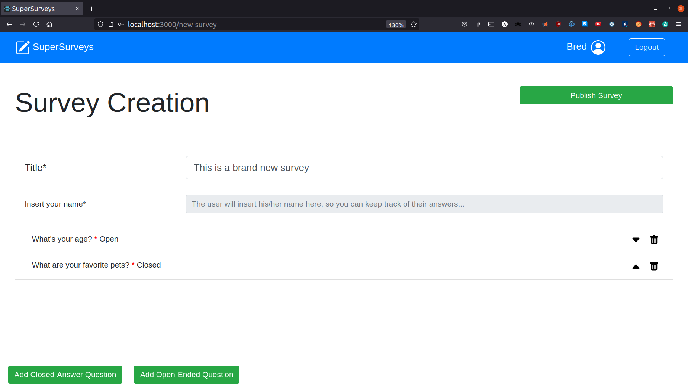
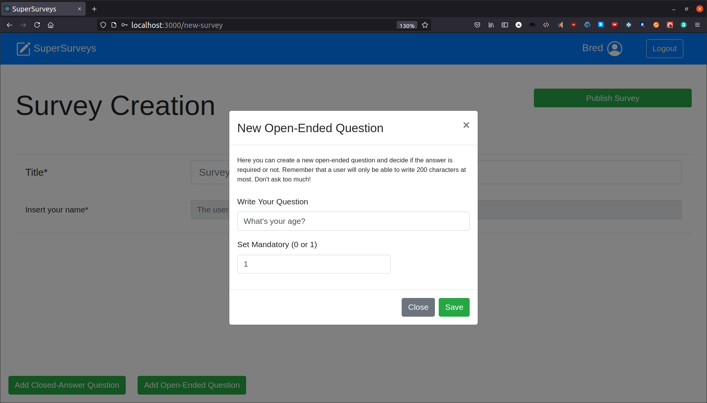
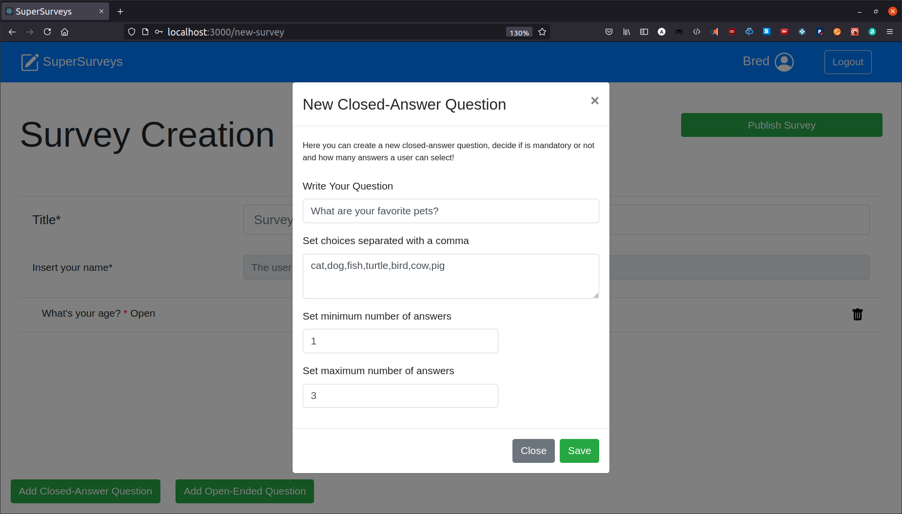

# Exam #1: "Survey"
## Student: s292435 VERSACE ALESSANDRO 

## React Client Application Routes

- Route `/`: Homepage that lists all opened surveys and let the user chose which one to compile.
- Route `/login`: Login page with some inputs to proceed with login operation to access administration routes.
- Route `/my-surveys`: Admin page where are listed all admin's opened surveys and click to create a new one or click to show replies from users to a specific survey.
- Route `/new-survey`: Page to handle the creation of a brend new survey accessible only if an admin is logged in.
- Route `/new-answer/:id`: Page to handle compiling and sending of a new reply to a specific opened survey given its :id (of the survey).
- Route `/show-results/:surveyId/:nReply/:replyId`: Page to handle the show and the navigation through received replies to a specific survey, accessible only if the admin is logged in. 
:surveyId is the id of the admin's opened survey
:nReply is the number of available replies to the specified survey
:replyId is the id of the specific reply showed in that page

## API Server

Going ahead (except for some of the first routes) I decided to insert only successful request - response communications (HTTP 2XX).

- POST `/api/sessions` used for login session creation
  - ```http
    POST http://localhost:3001/api/sessions
    Content-Type: application/json

    {
      "username": "alessandro.versace@polito.it", 
      "password": "SecurePassword"
    }
    ```
  - ```http
    HTTP/1.1 200 OK
    X-Powered-By: Express
    Content-Type: application/json; charset=utf-8
    Content-Length: 70
    ETag: W/"46-IFmC54b0zGR8Fx9x6a6MNv1VJPw"
    Set-Cookie: connect.sid=s%3AOAv1_uNZWIBBnLsmVcQS-UT_-YM03YZa.9PHt0bXbzpU4JSo%2FOdM%2BB%2BmRINziqzgCWXeBXk7vXeE; Path=/; HttpOnly
    Date: Fri, 25 Jun 2021 15:38:06 GMT
    Connection: close

    {
      "id": 1,
      "username": "alessandro.versace@polito.it",
      "name": "Alessandro"
    }


    # Or with wrong credentials

    HTTP/1.1 401 Unauthorized
    X-Powered-By: Express
    Content-Type: application/json; charset=utf-8
    Content-Length: 49
    ETag: W/"31-Zoymuc0GB5Y05HVb13yrtWLixv4"
    Date: Fri, 25 Jun 2021 15:39:26 GMT
    Connection: close

    {
      "message": "Incorrect username and/or password."
    }
    ```
- GET `/api/sessions/current` Check if the user is logged in or not
  - ```http
    GET http://localhost:3001/api/sessions/current 
    ```
  - ```http
    HTTP/1.1 200 OK
    X-Powered-By: Express
    Content-Type: application/json; charset=utf-8
    Content-Length: 70
    ETag: W/"46-IFmC54b0zGR8Fx9x6a6MNv1VJPw"
    Date: Fri, 25 Jun 2021 15:44:37 GMT
    Connection: close

    {
      "id": 1,
      "username": "alessandro.versace@polito.it",
      "name": "Alessandro"
    }


    # No on going session

    HTTP/1.1 401 Unauthorized
    X-Powered-By: Express
    Content-Type: application/json; charset=utf-8
    Content-Length: 33
    ETag: W/"21-V8x1OYsvKEIKIAIW760m3YHzhZ0"
    Date: Fri, 25 Jun 2021 15:42:51 GMT
    Connection: close

    {
      "error": "Unauthenticated user!"
    }
    ```
- DELETE `/api/sessions/current` Logout
  - ```http
    DELETE http://localhost:3001/api/sessions/current 
    ```
  - ```http
    HTTP/1.1 200 OK
    X-Powered-By: Express
    Date: Fri, 25 Jun 2021 18:03:47 GMT
    Connection: close
    Transfer-Encoding: chunked
    ```
- GET `/api/surveys` Retrieve all opened surveys overview info (doesn't require auth)
  - ```http
    GET http://localhost:3001/api/surveys
    ```
  - ```http
    HTTP/1.1 200 OK
    X-Powered-By: Express
    Content-Type: application/json; charset=utf-8
    Content-Length: 139
    ETag: W/"8b-yi0TFsOk/TJs85Zqx0O9j+PE4pA"
    Date: Fri, 25 Jun 2021 18:11:54 GMT
    Connection: close

    [
      {
        "id": 1,
        "user": 1,
        "title": "Food Survey",
        "nQuestions": 5,
        "nAnswers": 2
      },
      {
        "id": 2,
        "user": 2,
        "title": "Music and you",
        "nQuestions": 3,
        "nAnswers": 2
      }
    ]
    ```
- GET `/api/surveys/user` Retrieve all user specific opened surveys (requires auth)
  - ```http
    GET http://localhost:3001/api/surveys/user
    ```
  - ```http
    HTTP/1.1 200 OK
    X-Powered-By: Express
    Content-Type: application/json; charset=utf-8
    Content-Length: 69
    ETag: W/"45-KdKfl52CC2bBTqx5JcaAOFh/YcA"
    Date: Fri, 25 Jun 2021 18:34:31 GMT
    Connection: close

    [
      {
        "id": 1,
        "user": 1,
        "title": "Food Survey",
        "nQuestions": 5,
        "nAnswers": 2
      }
    ]
    ```
- POST `/api/surveys/user/new-survey` Save a brand new survey (requires auth)
  - ```http
    POST http://localhost:3001/api/surveys/user/new-survey
    Content-Type: application/json
    {"id":0,"title":"Useless Survey","nQuestions":4,"questionsList":[{"questionId":1,"title":"Tell me anything","open":true,"min":1,"reply":""},{"questionId":2,"title":"Are you sure you've told me anything?","open":false,"min":1,"max":2,"answers":["Yes","No","Maybe","Not Sure","Mmmh..."],"reply":[]},{"questionId":4,"title":"Ok now tell me if you're ok to tell me anything","open":false,"min":1,"max":1,"answers":["Yes I am","No I don't know you"],"reply":[]},{"questionId":5,"title":"Your opinion about this survey","open":true,"min":1,"reply":""}],"replyId":-1,"username":""}
    ```
  - ```http
    HTTP/1.1 201 Created
    X-Powered-By: Express
    Content-Type: application/json; charset=utf-8
    Content-Length: 12
    ETag: W/"c-dP8xfwfp+cZR31j3u+PzAVhxRjM"
    Date: Sat, 26 Jun 2021 10:29:38 GMT
    Connection: close

    {
      "ok": "ok!"
    }
    ```
- GET `/api/surveys/:id` Retrieve a survey by its id (doesn't require auth)
  - ```http
    GET http://localhost:3001/api/surveys/1
    ```
  - ```http
    HTTP/1.1 200 OK
    X-Powered-By: Express
    Content-Type: application/json; charset=utf-8
    Content-Length: 67
    ETag: W/"43-44si29YAOWxTcplJvziK7pksQBk"
    Date: Fri, 25 Jun 2021 20:15:46 GMT
    Connection: close

    {
      "id": 1,
      "user": 1,
      "title": "Food Survey",
      "nQuestions": 5,
      "nAnswers": 2
    }
    ```
- GET `/api/surveys/:surveyId/questions` Retrieve all survey's questions by its survey id (doesn't require auth)
  - ```http
    GET http://localhost:3001/api/surveys/1/questions
    ```
  - ```http
    HTTP/1.1 200 OK
    X-Powered-By: Express
    Content-Type: application/json; charset=utf-8
    Content-Length: 457
    ETag: W/"1c9-IQuhELUG4ovYP5IEyRJPYv4zk+M"
    Date: Fri, 25 Jun 2021 20:18:47 GMT
    Connection: close

    [
      {
        "surveyId": 1,
        "questionId": 1,
        "questionTitle": "Tell me if you like ice creams",
        "min": 1,
        "max": -1
      },
      {
        "surveyId": 1,
        "questionId": 2,
        "questionTitle": "What food do you prefer?",
        "min": 1,
        "max": 1
      },
      {
        "surveyId": 1,
        "questionId": 3,
        "questionTitle": "Have you ever eaten a pizza?",
        "min": 0,
        "max": 2
      },
      {
        "surveyId": 1,
        "questionId": 4,
        "questionTitle": "Do you like sushi?",
        "min": 0,
        "max": -1
      },
      {
        "surveyId": 1,
        "questionId": 5,
        "questionTitle": "Select which food you like...",
        "min": 2,
        "max": 4
      }
    ]
    ```
- GET `/api/surveys/:surveyId/questions/:questionId/choices` Retrieve all question's choices by survey id and question id (doesn't require auth)
  - ```http
    GET http://localhost:3001/api/surveys/1/questions/2/choices
    ```
  - ```http
    HTTP/1.1 200 OK
    X-Powered-By: Express
    Content-Type: application/json; charset=utf-8
    Content-Length: 257
    ETag: W/"101-xhoMGiuzTnQ3CA0xBc9cpwmJmEQ"
    Date: Fri, 25 Jun 2021 20:29:12 GMT
    Connection: close

    [
      {
        "surveyId": 1,
        "questionId": 2,
        "choiceId": 1,
        "choice": "bread"
      },
      {
        "surveyId": 1,
        "questionId": 2,
        "choiceId": 2,
        "choice": "pasta"
      },
      {
        "surveyId": 1,
        "questionId": 2,
        "choiceId": 3,
        "choice": "potatoes"
      },
      {
        "surveyId": 1,
        "questionId": 2,
        "choiceId": 4,
        "choice": "I don't like them "
      }
    ]
    ```
- POST `/api/surveys/new-reply` Send a new reply to a specific survey (doesn't require auth)
  - ```http
    POST http://localhost:3001/api/surveys/new-reply HTTP/1.1
    Content-Type: application/json

    {"id":2,"title":"Music and you","nQuestions":3,"questionsList":[{"questionId":1,"title":"Tell me about your music preferences","open":true,"min":1,"reply":"I hate music, it reminds me to some old ugly situations."},{"questionId":2,"title":"Your age","open":false,"min":1,"max":1,"answers":[{"choiceId":1,"choice":"15-20"},{"choiceId":2,"choice":"20-30"},{"choiceId":3,"choice":"30-40"},{"choiceId":4,"choice":"40-50"},{"choiceId":5,"choice":"50+"}],"reply":[4]},{"questionId":3,"title":"What do you play?","open":false,"min":0,"max":7,"answers":[{"choiceId":1,"choice":"Jazz"},{"choiceId":2,"choice":" Dance"},{"choiceId":3,"choice":" House"},{"choiceId":4,"choice":" Rock"},{"choiceId":5,"choice":" Punk"},{"choiceId":6,"choice":" Classical"},{"choiceId":7,"choice":" Pop"}],"reply":[]}],"replyId":-1,"username":"Bob"}
    ```
  - ```http
    HTTP/1.1 201 Created
    X-Powered-By: Express
    Content-Type: application/json; charset=utf-8
    Content-Length: 12
    ETag: W/"c-dP8xfwfp+cZR31j3u+PzAVhxRjM"
    Date: Sat, 26 Jun 2021 10:30:27 GMT
    Connection: close

    {
      "ok": "ok!"
    }
    ```
- GET `/api/surveys/:id/replies/:rid/username` Retrieve the username of a survey reply given surveyId and replyId (requires auth)
  - ```http
    GET http://localhost:3001/api/surveys/1/replies/1/username
    ```
  - ```http
    HTTP/1.1 200 OK
    X-Powered-By: Express
    Content-Type: application/json; charset=utf-8
    Content-Length: 12
    ETag: W/"c-xCwnAfz52a156CiyJ39K+eMFDtQ"
    Date: Fri, 25 Jun 2021 20:59:00 GMT
    Connection: close

    "Alessandro"
    ```
- GET `/api/surveys/1/replies/1/questions/2/closed` Retrieve replies of a CLOSED question given surveyId, replyId, questionId (requires auth)
  - ```http
    GET http://localhost:3001/api/surveys/1/replies/1/questions/2/closed
    ```
  - ```http
    HTTP/1.1 200 OK
    X-Powered-By: Express
    Content-Type: application/json; charset=utf-8
    Content-Length: 16
    ETag: W/"10-fCi299o9IIkHbzsVjBQCZYAnzpM"
    Date: Fri, 25 Jun 2021 21:08:44 GMT
    Connection: close

    [
      {
        "choiceId": 2
      }
    ]
    ```
- GET `/api/surveys/:id/replies/:rid/questions/:qid` Retrieve replies of a OPEN question given surveyId, replyId, questionId (requires auth) 
  - ```http
    GET http://localhost:3001/api/surveys/1/replies/1/questions/1
    ```
  - ```http
    HTTP/1.1 200 OK
    X-Powered-By: Express
    Content-Type: application/json; charset=utf-8
    Content-Length: 55
    ETag: W/"37-FmhqF1Ka4XEA7vNsZUh0uF6tVKs"
    Date: Fri, 25 Jun 2021 21:10:35 GMT
    Connection: close

    "I do, that's one of my favourite food in a cheat day."
    ```

## Database Tables

- Table `users` - contains (<ins>id</ins>, email, name, hash) of users for authentication purpose.
- Table `surveys` - contains (<ins>id</ins>, user, title, nQuestions, nAnswers) that are a survey overview info.
- Table `questions` contains (<ins>surveyId</ins>, <ins>questionId</ins>, questionTitle, min, max) that are questions overviews with min and max used to deduct if are opened or closed ones.
- Table `closedQuestionChoices` - contains (<ins>surveyId</ins>, <ins>questionId</ins>, <ins>choiceId</ins>, choice) that collect choices with a unique id related to specific a question.
- Table `replies` - contains (<ins>surveyId</ins>, <ins>replyId</ins>, username) that relates a specific reply and the related username with a specific survey.
- Table `openReplies` - contains (<ins>surveyId</ins>, <ins>replyId</ins>, <ins>questionId</ins>, reply) that relates a specific reply to an open question to the relative reply and survey.
- Table `closedReplies` - contains (<ins>surveyId</ins>, <ins>replyId</ins>, <ins>questionId</ins>, <ins>choiceId</ins>) that relates specific choiceId as replies to a specific question's reply to a survey.

## Main React Components

- `App` (in `App.js`): Contains basic structures of the web app components, with a custom navbar and the main content, data structures and login/logout functions.
- `NavbarCustom` (in `customNavbar/NavbarCustom.js`): Contains basic navbar functionalities with a clickable logo that links to the main page, the login button or the user info with logout button.
- `LoginForm` (in `login/LoginForm.js`): Contains form to collect admin credentials and validate them.
- `MainContent` (in `mainContent/MainContent.js`): Contains react router function to handle rendering of the main content based on urls. 
- `OpenedSurveys` (in `mainContent/MainContent.js`): Performs a request to retrieve all opened surveys and then displays them giving overview info and letting a user click to start compiling one of them.
- `UserSurveys` (in `mainContent/MainContent.js`): Performs a request to retrieve admin's opened surveys and then displays them giving overview info and click to create a brand new survey.
- `SurveyToCompile` (in `surveyToCompile/SurveyToCompile.js`): Contains the graphical handling of a single survey overview based on the route we are in, letting click to compile a survey or click to show replies.
- `NewAnswerWrapper` (in `surveyToCompile/NewAnswer.js`): Contains all feature to retrieve the right survey to compile and to send a new reply, showing all questions and asking to complete the survey before submitting with validation, including also a modal component to show proper info about the questions.
- `ModalForm` (in `surveyToCompile/ModalForm.js`): Contains the modal and forms with information about the specific question plus validation, handling proper display and letting the user select or write the specific answer.
- `NewSurveyWrapper` (in `newSurvey/NewSurvey.js`): Contains all states and components to handle the creation and sending of a brand new survey from an admin to the backend. It displays a title form and an overview of already created question, then the possibility to add using buttons a new open/closed question using the appropriate modal component.
- `ModalForm` (in `newSurvey/ModalForm.js`): Contains the modal and forms to be filled with information about the specific new question to be created plus validation.
- `ShowResultsWrapper` (in `showReplies/ShowResults.js`): Contains a pagination component to allow the admin navigation through different users' replies retrieving and rendering in each page information about questions' replies of a certain user.
- `ModalForm` (in `showReplies/ModalForm.js`): Contains the modal and forms filled with replies (or blank forms) in read only mode, based on specific user reply to the survey. 


(only _main_ components, minor ones may be skipped)

## Screenshot





## Users Credentials

- alessandro.versace@polito.it, SecurePassword
  >Surveys created:
  -Food Survey
  -Useless Survey
- secondUser@something.com, password
  >Surveys created:
  -Music and you